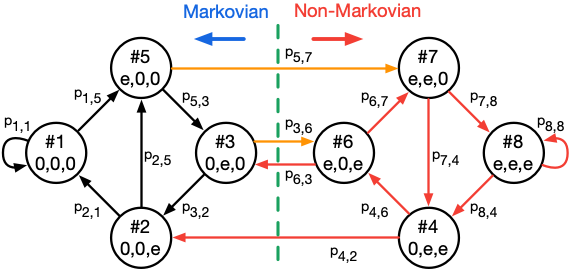

##### Abstract

This brief discusses the limitation of previously pub-
lished statistical decision feedback equalizer (DFE) models when
residual inter-symbol interference (ISI) is present and proposes
a method that overcomes this limitation. The paper presents
an accurate closed-form expression for the DFE with residual
ISI and additive white Gaussian noise (AWGN). The analysis
is extended to 4-level pulse amplitude modulation (PAM-4) to
cover serial links of current interest. The results verify that the
proposed model estimates an accurate bit error rate (BER).

---

##### Download

+ [You can find the paper here.](https://ieeexplore.ieee.org/stamp/stamp.jsp?arnumber=9495928)
<!-- + [Online appendix](appendix2.pdf)
+ [Code and data](https://github.com/pmichaillat/unemployment-gap) -->

<!-- ---

##### Adjacency matrix A and its corresponding digraph G


 -->
---
<!-- 
##### Citation

Author 1 and Author 2. Year. "Title." *Journal* Volume (Issue): First page–Last page. https://doi.org/paper_doi.

```BibTeX
@article{AAYY,
author = {Author 1 and Author 2},
doi = {paper_doi},
journal = {Journal},
number = {Issue},
pages = {XXX--YYY},
title ={Title},
volume = {Volume},
year = {Year}}
```

---

##### Related material

+ [Presentation slides](presentation2.pdf)
 -->
